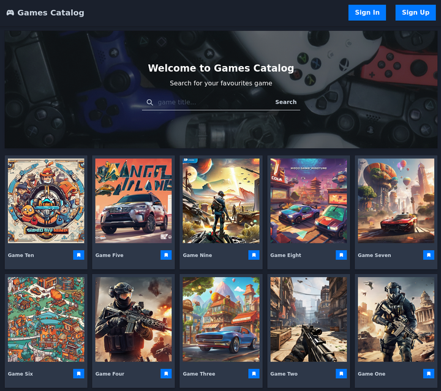
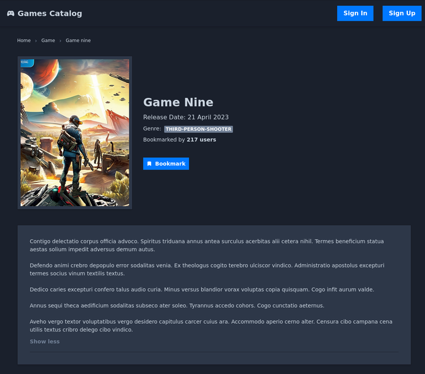
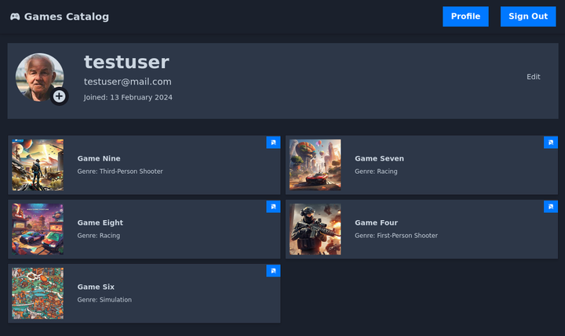

## Games Catalog

#### built with

| Tools  |  |
| :--- | :--- |
| Next JS  | https://nextjs.org/  |
| React Query | https://tanstack.com/query/v5  |
| Chakra UI | https://chakra-ui.com |
| etc |  |

#### API

https://github.com/qrizan/nestjs-swagger-prisma

#### api configuration .env
```
copy .env.example .env
```
example
```
NEXT_PUBLIC_API_BACKEND = 'http://localhost:3000'
```

#### robots.txt configuration
- /src/pages/api/robots.ts

 
> check URL: http://<YOUR_DOMAIN>/robots.txt 

 
#### games sitemap.xml configuration
- /src/pages/sitemap.xml.ts


> check URL: http://<YOUR_DOMAIN>/sitemap.xml

#### hostname image configuration 
- next.config.mjs
```
...
  images: {
    remotePatterns: [
      {
        protocol: 'http',
        hostname: 'localhost'
      },
      {
        protocol: 'https',
        hostname: '**',
        port: '',
        pathname: '**',
      },
    ],
  },
...
```
#### running
```
cd nextjs-chakra-reactquery
pnpm install
pnpm dev
```
> check URL: http://localhost:8080
#### screenshots





