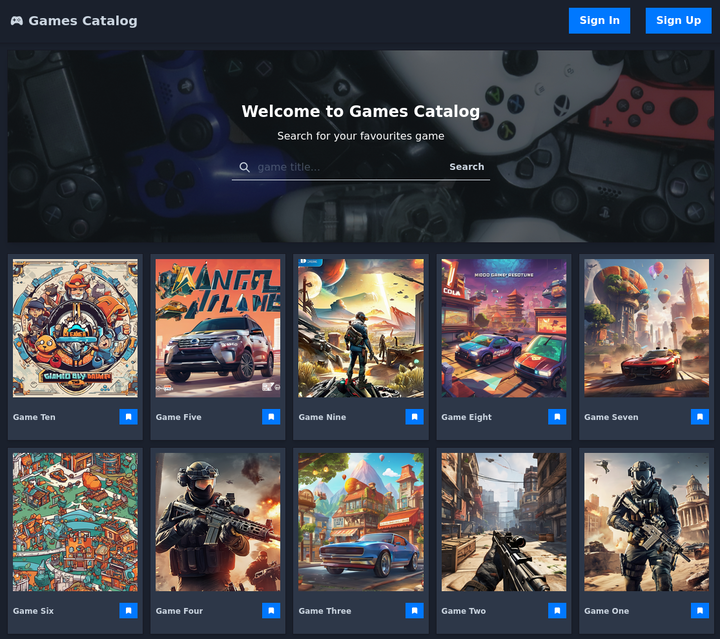
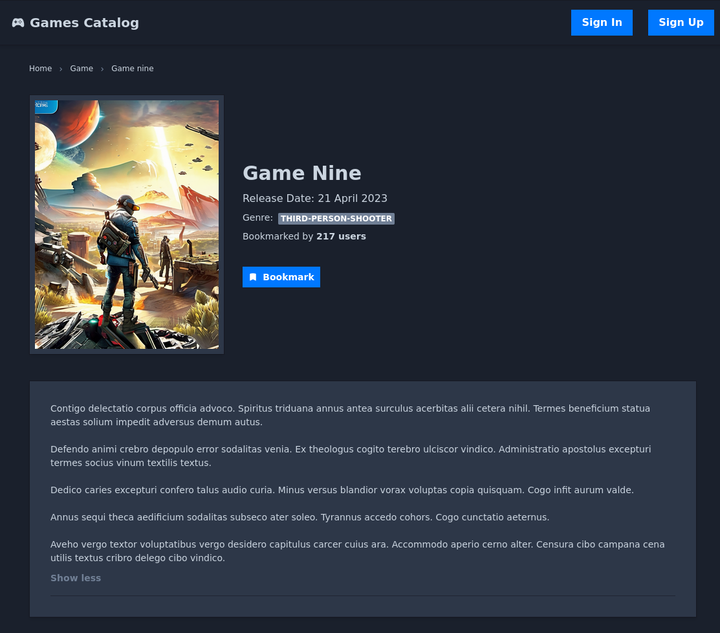
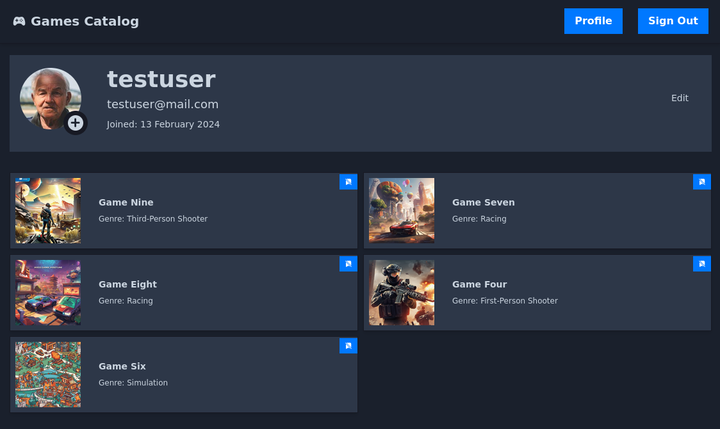

## Games Catalog

#### built with

| Tools  |  |
| :--- | :--- |
| Next JS  | https://nextjs.org/  |
| React Query | https://tanstack.com/query/v5  |
| Chakra UI | https://chakra-ui.com |
| etc |  |

#### API

https://github.com/qrizan/nestjs-swagger-prisma

#### api configuration .env
```
copy .env.example .env
```
example
```
NEXT_PUBLIC_API_BACKEND = 'http://localhost:3000'
API_URL = 'http://localhost:3000'
```

`NEXT_PUBLIC_API_BACKEND` dipakai untuk `pnpm dev` (di-*bake* saat build). `API_URL` dipakai kode sisi server (SSR) dan, saat menjalankan container, saat runtime — lihat bagian container image.

#### container image

```
ghcr.io/qrizan/nextjs-chakra-reactquery:<versi>
```

Tag versi dibuat dari git tag `v*.*.*`, tanpa tag `latest`. Image menjalankan Next.js standalone (non-root, port 8080). `API_URL` **tidak** di-*bake* ke image — dibaca dari environment container saat start dan ditulis ke `config.js` (dipakai client-side) sekaligus dipakai langsung oleh kode SSR, sehingga image yang sama bisa dipakai untuk API URL berapa pun:

```bash
docker run -d --name web -p 8080:8080 \
  -e API_URL='https://api.example.com' \
  ghcr.io/qrizan/nextjs-chakra-reactquery:0.0.1-rc.4
```

#### robots.txt configuration
- /src/pages/api/robots.ts

 
> check URL: http://<YOUR_DOMAIN>/robots.txt 

 
#### games sitemap.xml configuration
- /src/pages/sitemap.xml.ts


> check URL: http://<YOUR_DOMAIN>/sitemap.xml

#### running
```
cd nextjs-chakra-reactquery
pnpm install
pnpm dev
```
> check URL: http://localhost:8080
#### screenshots





